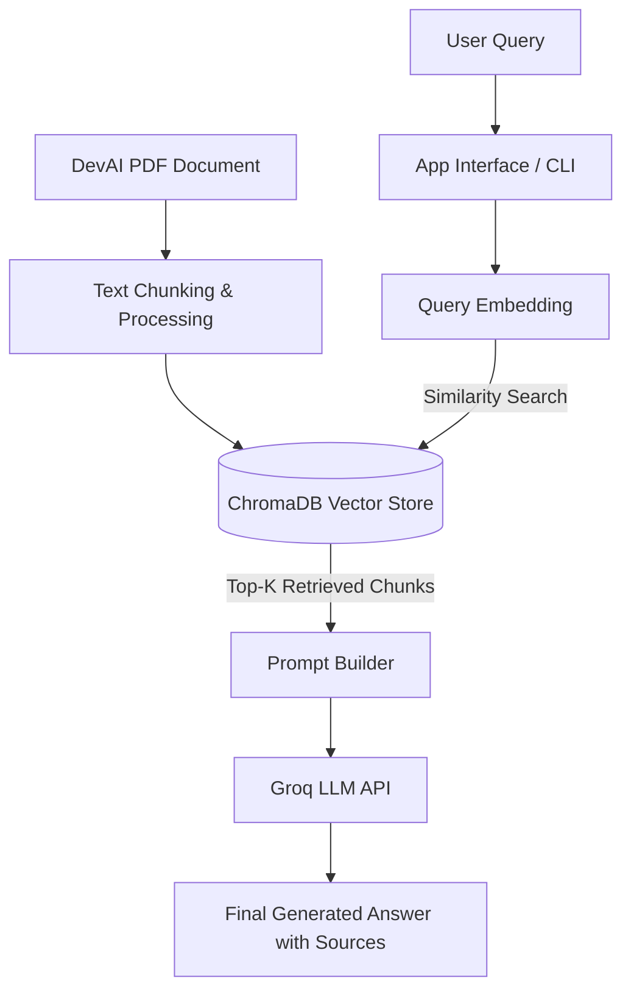

# Product Intern - Machine Learning & Gen-AI : RAG Chatbot (Case Study)

A robust Retrieval-Augmented Generation (RAG) chatbot pipeline built to ingest technical documentation, parse documents, store embeddings, and perform accurate question answering with retrieved context.

---

## 🛠️ Tech Stack & Architecture

* **LLM Engine:** Groq (Openai-gpt-oss-20b)
* **Vector Database:** ChromaDB
* **Orchestration:** LangChain / Custom Python Scripts
* **Environment Management:** Python-dotenv

---

## 🔄 RAG Process Workflow



## 📁 Repository Structure

```text
v3/
│
├── data/
│   └── agent_as_a_judge.pdf      # Source document for ingestion
│
├── src/
│   ├── app.py                    # Main application / chatbot entry point
│   ├── ingest.py                 # Document loading, splitting, and vector store indexing
│   ├── prompts.py                # System prompt templates
│   └── rag.py                    # RAG chain logic and retrieval implementation
│
├── .env.example                  # Environment configuration template
├── .gitignore                    # Ignored files (cache, virtualenvs, etc.)
├── requirements.txt              # Python package dependencies
└── README.md                     # Project documentation and workflow
```

## 🚀 Setup and Installation

1. Clone the repository (and ensure you are in the project root directory).
2. Install dependencies :
```
pip install -r requirements.txt
```
3. Configure environment variables.
4. Ingest documents and run the pipeline :
```
python v3/src/ingest.py
streamlit run v3/src/app.py
```


