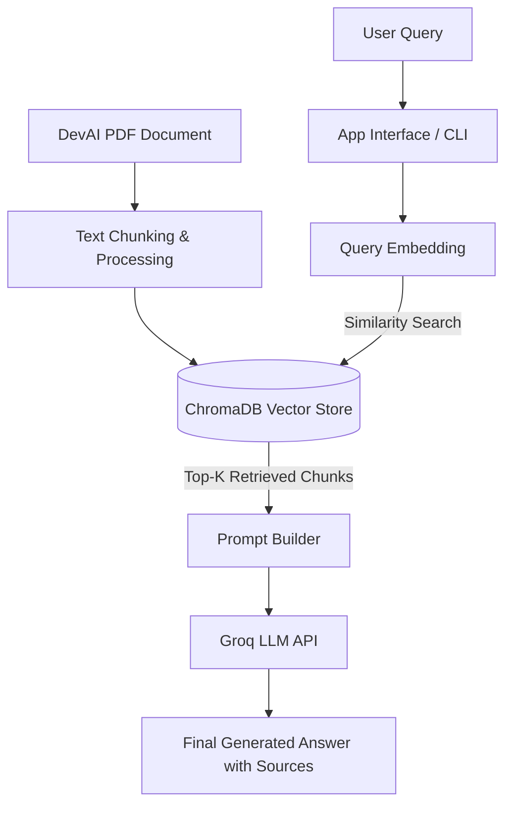

# Product Intern - Machine Learning & Gen-AI : RAG Chatbot (Case Study)

A Retrieval-Augmented Generation (RAG) chatbot that ingests the research paper
**"Agent-as-a-Judge: Evaluate Agents with Agents"** (Zhuge et al., Meta AI & KAUST, 2024) and answers
questions about it, **showing the exact PDF chunks each answer is based on**.
 
## ✨ Highlights
 
- **Hybrid retrieval**: semantic search (ChromaDB + MiniLM) combined with BM25 keyword search, so both meaning and exact table numbers (`44.80%`, `$6.38`) are found.
- **Grounded answers**: the LLM (Groq) answers only from the retrieved context and cites the page.
- **Transparent**: every answer comes with its evidence chunks (page, chunk number, and which search found it).
- **Two ways to use it**: a Streamlit chat UI, and a one-command batch run that answers the whole question bank into `answers.md`.
- **Small and readable**: four Python files, no heavy framework.

---
## 🛠️ Tech stack

| Layer | Technology |
|---|---|
| Language | Python 3 |
| PDF parsing | PyMuPDF (`pymupdf`) |
| Embeddings | `sentence-transformers` with `all-MiniLM-L6-v2` |
| Vector database | ChromaDB (persistent, cosine similarity) |
| Keyword search | BM25, implemented in `src/rag.py` (no extra library) |
| Retrieval fusion | Reciprocal Rank Fusion, with slots guaranteed to each search |
| LLM | Groq API, default `openai/gpt-oss-20b` (set with `GROQ_MODEL`) |
| Prompts | Plain Python with `textwrap.dedent` (`src/prompts.py`) |
| UI | Streamlit chat interface |
| Config | `python-dotenv` (`.env`) |

---

## 🔄 RAG Process Workflow



## ⚙️ How it works

1. **Ingestion (src/ingest.py)** : the PDF is read page by page with PyMuPDF, cleaned, and split into ~800-character chunks with 150 characters of overlap (about 213 chunks). Each chunk keeps its page and chunk number. Chunks are embedded with all-MiniLM-L6-v2 and stored in ChromaDB.

2. **Retrieval (src/rag.py)** : the question is searched two ways, semantically (top 20) and by BM25 keywords (top 20, implemented in about 20 lines, no extra library). Each search is guaranteed half of the final slots and the remaining slots are filled by reciprocal-rank-fusion score, giving 8 chunks.

3. **Generation (src/rag.py, src/prompts.py)** : the chunks and the question are sent to a Groq LLM with strict rules: answer only from the context, copy numbers exactly, respect the section/table/figure named in the question, and cite the page.

4. **Interface (src/app.py)** : a Streamlit chat with chat history, a sidebar question bank, and expandable evidence for every answer.


## 📁 Repository Structure

```text
v3/
│
├── data/
│   └── agent_as_a_judge.pdf      # Source document for ingestion
│
├── src/
│   ├── app.py                    # Main application / chatbot entry point
│   ├── ingest.py                 # Document loading, splitting, and vector store indexing
│   ├── prompts.py                # System prompt templates
│   └── rag.py                    # RAG chain logic and retrieval implementation
│
├── .env.example                  # Environment configuration template
├── .gitignore                    # Ignored files (cache, virtualenvs, etc.)
├── requirements.txt              # Python package dependencies
└── README.md                     # Project documentation and workflow
```

## 🚀 Setup and Run

### 1. create and activate a virtual environment
```
python -m venv .venv
.venv\Scripts\Activate.ps1          # Windows PowerShell
source .venv/bin/activate         # Linux / macOS
```
### 2. install dependencies
```
pip install -r requirements.txt
```
### 3. Configure environment variables.

### 4. build the vector database (run once)
```
python src/ingest.py
```
### 5a. chat UI
```
streamlit run src/app.py
```
### 5b. or answer the whole question bank into answers.md
```
python src/rag.py
```
Settings in `.env`: `GROQ_API_KEY` (required), `GROQ_MODEL` (default `openai/gpt-oss-20b`), `TOP_K` (chunks per answer, default 8).

## 📊 Question bank results
 
Answers below were produced by the chatbot and checked against the paper.
The full answers with their retrieved chunks are in [`answers.md`](answers.md).
 
| Q | Question (short) | Chatbot answer |
|---|---|---|
| 4 | What is DevAI? | Benchmark of 55 AI development tasks, 365 requirements, 125 preferences |
| 5 | Time and cost saved vs 3 human experts | 97.72% of time, 97.64% of cost |
| 6 | Cost and time (Section 4.4) | Agent-as-a-Judge: $30.58 and 118.43 min; Human-as-a-Judge: about $1,297.50 and 86.5 h |
| 7 | Frameworks benchmarked | MetaGPT, GPT-Pilot, OpenHands |
| 8 | OpenHands average cost and time | $6.38 and 362.41 s |
| 9 | Most cost-efficient / most expensive | MetaGPT ($1.19) / OpenHands ($6.38) |
| 10 | GPT-Pilot Requirements Met (I), Human | 44.80% |
| 11 | MetaGPT Task Solve Rate | 0.00% |
| 12 | Alignment rate, black-box, OpenHands | 90.44% |
| 13 | Only `ask` vs after graph + read + locate | 65.03% then 90.44% |
| 14 | Best search algorithm | No search module (90.44%) |
| 15 | Most frequent architectures in queries | SVM classifiers and LSTM |
| 16 | Requirement R1 (Devin task) | "Ensure the generated images are of 1080p resolution and saved in results/." |
| 17 | Evaluator with most errors on GPT-Pilot | cn9o (written cn90 in the form), 23.77% |
| 18 | Drawback of Human-as-a-Judge in the diagram | Heavy manual effort, a bottleneck for developers |
 
## 🧠 Design decisions
 
- **Small chunks (800 chars)**: many questions target one table row or one figure caption. Large chunks let neighbouring text and diagram labels dilute the match.
- **Hybrid search**: dense embeddings handle paraphrased questions; BM25 handles exact numbers and table terms. In our run some evidence chunks were found by only one of the two searches, which is why both are kept.
- **Temperature 0 and strict prompt**: reproducible answers, exact numbers, and "context insufficient" instead of guessing.
- **`$` escaping in the UI**: Streamlit renders `$...$` as math, so dollar signs are escaped to keep values like `$6.38` readable.

## ⚠️ Limitations
 
- Text comes from the PDF text layer. Text that exists only inside chart images (for example axis labels in Figure 2) is not OCR'd; no question in the question bank depends on it.
- The paper's Section 4.4 states the cost and time percentages in the opposite order to the introduction (2.29% cost / 2.36% time versus 97.72% time / 97.64% cost saved). The chatbot reports what each section says.
- Answer quality depends on the chosen Groq model; `openai/gpt-oss-20b` is recommended for table questions.

