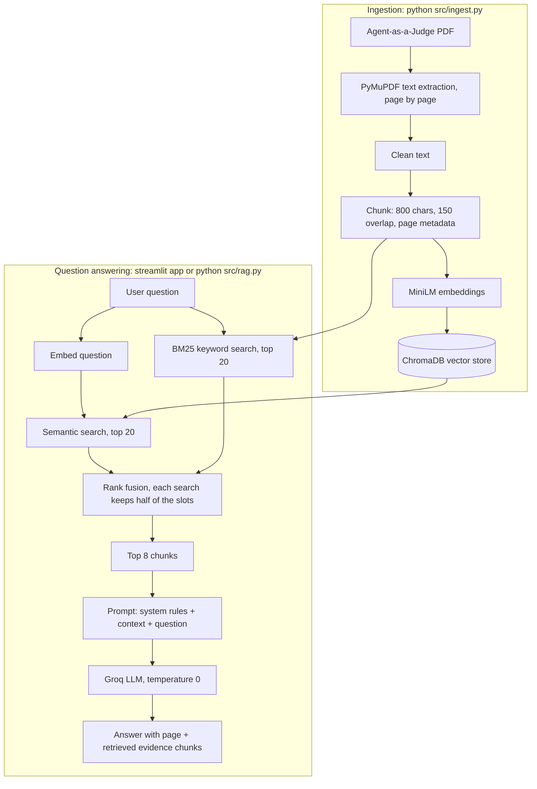

# Agent-as-a-Judge RAG Chatbot

A Retrieval-Augmented Generation (RAG) chatbot over the paper
**"Agent-as-a-Judge: Evaluate Agents with Agents"** (Zhuge et al., 2024).
It uses **hybrid retrieval** (semantic + keyword) and a Groq LLM that answers only from the retrieved chunks.

## RAG workflow



## Why hybrid retrieval

Many questions target exact numbers in tables (e.g. `44.80%`, `$6.38`) or text inside figures.
Semantic search finds meaning; BM25 finds exact terms. Using both, and keeping small 800-character
chunks, makes sure one table row or figure caption is not diluted by surrounding text.

## Project structure

| File | Purpose |
|---|---|
| `src/ingest.py` | Extract, clean, chunk, embed and store the PDF in ChromaDB |
| `src/rag.py` | Hybrid retrieval + answer generation; `python src/rag.py` answers the whole question bank into `answers.md` |
| `src/prompts.py` | System and user prompts |
| `src/app.py` | Streamlit chat UI showing the answer and the retrieved chunks |

## Setup

```bash
python -m venv .venv
.venv\Scripts\Activate.ps1        # Windows PowerShell (Linux/Mac: source .venv/bin/activate)
pip install -r requirements.txt
copy .env.example .env            # then put your Groq API key in .env
python src/ingest.py              # build the vector database (run once)
streamlit run src/app.py          # chat UI
python src/rag.py                 # optional: answer all form questions -> answers.md
```

## Limitations

Text is taken from the PDF text layer. Text that is only part of a chart image (for example axis labels
in Figure 2) is not OCR'd; no question in the question bank depends on it.
